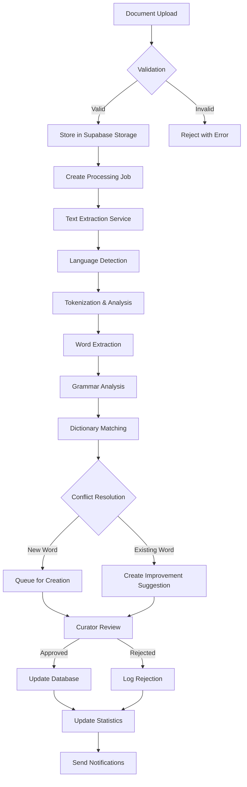

# MobTranslate Curation System Plan (Updated)

## Overview

This updated plan takes into account the existing database structure and builds upon it to create a comprehensive curation system. The existing database already has a solid foundation with tables for words, languages, translations, definitions, and user interactions.

## Existing Database Analysis

### Current Tables
- **Core Language Tables**: `languages`, `words`, `translations`, `definitions`, `dialects`
- **Word Relationships**: `synonyms`, `antonyms`, `word_relationships`, `etymologies`
- **User Interaction**: `user_favorites`, `user_word_likes`, `quiz_attempts`, `quiz_sessions`
- **Content Enhancement**: `usage_examples`, `cultural_contexts`, `audio_pronunciations`
- **User Management**: `profiles`, `user_profiles`, `contributors`, `language_contributors`
- **Tracking**: `word_revisions`, `search_history`, `spaced_repetition_states`

### Key Observations
1. The `words` table already has:
   - `created_by` and `approved_by` fields for basic curation
   - `version` field for revision tracking
   - Rich linguistic fields (gender, number, word_class_id, etc.)
   - `metadata` JSONB field for extensibility

2. `word_revisions` table exists for tracking changes
3. `contributors` and `language_contributors` tables suggest a contributor system exists
4. No explicit role-based access control system yet
5. No commenting or improvement suggestion system

## New Tables Required

### 1. User Roles and Permissions
```sql
-- User roles table
CREATE TABLE user_roles (
    id UUID PRIMARY KEY DEFAULT uuid_generate_v4(),
    name TEXT NOT NULL UNIQUE, -- 'super_admin', 'dictionary_admin', 'curator', 'contributor', 'user'
    display_name TEXT NOT NULL,
    description TEXT,
    permissions JSONB NOT NULL DEFAULT '{}',
    created_at TIMESTAMPTZ DEFAULT NOW()
);

-- User role assignments
CREATE TABLE user_role_assignments (
    id UUID PRIMARY KEY DEFAULT uuid_generate_v4(),
    user_id UUID REFERENCES auth.users(id) ON DELETE CASCADE,
    role_id UUID REFERENCES user_roles(id) ON DELETE CASCADE,
    language_id UUID REFERENCES languages(id) ON DELETE CASCADE, -- NULL for global roles
    assigned_by UUID REFERENCES auth.users(id),
    assigned_at TIMESTAMPTZ DEFAULT NOW(),
    expires_at TIMESTAMPTZ,
    is_active BOOLEAN DEFAULT true,
    UNIQUE(user_id, role_id, language_id)
);
```

### 2. Comments System
```sql
-- Word comments
CREATE TABLE word_comments (
    id UUID PRIMARY KEY DEFAULT uuid_generate_v4(),
    word_id UUID REFERENCES words(id) ON DELETE CASCADE,
    user_id UUID REFERENCES auth.users(id) ON DELETE CASCADE,
    parent_id UUID REFERENCES word_comments(id) ON DELETE CASCADE,
    comment_text TEXT NOT NULL,
    comment_type TEXT DEFAULT 'general', -- 'general', 'pronunciation', 'usage', 'cultural', 'grammar'
    is_edited BOOLEAN DEFAULT false,
    edited_at TIMESTAMPTZ,
    is_deleted BOOLEAN DEFAULT false,
    deleted_at TIMESTAMPTZ,
    deleted_by UUID REFERENCES auth.users(id),
    upvotes INTEGER DEFAULT 0,
    downvotes INTEGER DEFAULT 0,
    created_at TIMESTAMPTZ DEFAULT NOW(),
    updated_at TIMESTAMPTZ DEFAULT NOW()
);

-- Comment votes
CREATE TABLE comment_votes (
    id UUID PRIMARY KEY DEFAULT uuid_generate_v4(),
    comment_id UUID REFERENCES word_comments(id) ON DELETE CASCADE,
    user_id UUID REFERENCES auth.users(id) ON DELETE CASCADE,
    vote_type TEXT NOT NULL CHECK (vote_type IN ('up', 'down')),
    created_at TIMESTAMPTZ DEFAULT NOW(),
    UNIQUE(comment_id, user_id)
);
```

### 3. Word Improvements
```sql
-- Word improvement suggestions
CREATE TABLE word_improvement_suggestions (
    id UUID PRIMARY KEY DEFAULT uuid_generate_v4(),
    word_id UUID REFERENCES words(id) ON DELETE CASCADE,
    submitted_by UUID REFERENCES auth.users(id) ON DELETE CASCADE,
    improvement_type TEXT NOT NULL, -- 'definition', 'translation', 'example', 'pronunciation', 'grammar', 'cultural_context'
    field_name TEXT, -- specific field being improved
    current_value JSONB,
    suggested_value JSONB NOT NULL,
    improvement_reason TEXT,
    supporting_references TEXT[],
    status TEXT DEFAULT 'pending', -- 'pending', 'under_review', 'approved', 'rejected', 'implemented'
    reviewed_by UUID REFERENCES auth.users(id),
    reviewed_at TIMESTAMPTZ,
    review_comment TEXT,
    implemented_at TIMESTAMPTZ,
    implementation_notes TEXT,
    confidence_score FLOAT, -- 0-1, based on submitter reputation and supporting evidence
    created_at TIMESTAMPTZ DEFAULT NOW(),
    updated_at TIMESTAMPTZ DEFAULT NOW()
);

-- Improvement votes from other curators
CREATE TABLE improvement_votes (
    id UUID PRIMARY KEY DEFAULT uuid_generate_v4(),
    suggestion_id UUID REFERENCES word_improvement_suggestions(id) ON DELETE CASCADE,
    voter_id UUID REFERENCES auth.users(id) ON DELETE CASCADE,
    vote TEXT NOT NULL CHECK (vote IN ('approve', 'reject', 'needs_work')),
    comment TEXT,
    created_at TIMESTAMPTZ DEFAULT NOW(),
    UNIQUE(suggestion_id, voter_id)
);
```

### 4. Document Processing
```sql
-- Document uploads
CREATE TABLE document_uploads (
    id UUID PRIMARY KEY DEFAULT uuid_generate_v4(),
    language_id UUID REFERENCES languages(id) ON DELETE CASCADE,
    uploaded_by UUID REFERENCES auth.users(id) ON DELETE CASCADE,
    file_name TEXT NOT NULL,
    file_type TEXT NOT NULL,
    file_size BIGINT,
    file_url TEXT NOT NULL,
    storage_path TEXT NOT NULL,
    document_type TEXT, -- 'dictionary', 'story', 'grammar_guide', 'academic_paper', 'other'
    source_attribution TEXT,
    processing_status TEXT DEFAULT 'pending', -- 'pending', 'queued', 'processing', 'completed', 'failed', 'cancelled'
    processing_priority INTEGER DEFAULT 5, -- 1-10, higher = more priority
    processing_started_at TIMESTAMPTZ,
    processing_completed_at TIMESTAMPTZ,
    processing_error JSONB,
    extraction_config JSONB, -- configuration for the extraction process
    extraction_results JSONB, -- summary of what was extracted
    words_found INTEGER DEFAULT 0,
    words_new INTEGER DEFAULT 0,
    words_updated INTEGER DEFAULT 0,
    definitions_added INTEGER DEFAULT 0,
    examples_added INTEGER DEFAULT 0,
    approval_status TEXT DEFAULT 'pending', -- 'pending', 'approved', 'rejected'
    approved_by UUID REFERENCES auth.users(id),
    approved_at TIMESTAMPTZ,
    created_at TIMESTAMPTZ DEFAULT NOW(),
    updated_at TIMESTAMPTZ DEFAULT NOW()
);

-- Processing pipeline logs
CREATE TABLE document_processing_logs (
    id UUID PRIMARY KEY DEFAULT uuid_generate_v4(),
    document_id UUID REFERENCES document_uploads(id) ON DELETE CASCADE,
    stage TEXT NOT NULL, -- 'upload', 'validation', 'text_extraction', 'language_detection', 'tokenization', 'analysis', 'matching', 'import'
    status TEXT NOT NULL, -- 'started', 'in_progress', 'completed', 'failed', 'skipped'
    stage_data JSONB,
    error_details JSONB,
    duration_ms INTEGER,
    created_at TIMESTAMPTZ DEFAULT NOW()
);

-- Track word sources
CREATE TABLE word_sources (
    id UUID PRIMARY KEY DEFAULT uuid_generate_v4(),
    word_id UUID REFERENCES words(id) ON DELETE CASCADE,
    source_type TEXT NOT NULL, -- 'manual', 'document', 'api', 'import', 'community'
    source_id UUID, -- references document_uploads(id) or other source
    source_page INTEGER,
    source_line INTEGER,
    confidence_score FLOAT,
    extraction_metadata JSONB,
    created_at TIMESTAMPTZ DEFAULT NOW()
);
```

### 5. Curation Activity
```sql
-- Curator activity logs
CREATE TABLE curator_activities (
    id UUID PRIMARY KEY DEFAULT uuid_generate_v4(),
    user_id UUID REFERENCES auth.users(id) ON DELETE CASCADE,
    language_id UUID REFERENCES languages(id),
    activity_type TEXT NOT NULL, -- 'word_approved', 'word_rejected', 'word_edited', 'comment_moderated', 'document_reviewed', etc.
    target_type TEXT NOT NULL, -- 'word', 'comment', 'improvement', 'document'
    target_id UUID NOT NULL,
    activity_data JSONB,
    ip_address INET,
    user_agent TEXT,
    created_at TIMESTAMPTZ DEFAULT NOW()
);

-- Curator performance metrics
CREATE TABLE curator_metrics (
    id UUID PRIMARY KEY DEFAULT uuid_generate_v4(),
    user_id UUID REFERENCES auth.users(id) ON DELETE CASCADE,
    language_id UUID REFERENCES languages(id),
    period_start DATE NOT NULL,
    period_end DATE NOT NULL,
    words_reviewed INTEGER DEFAULT 0,
    words_approved INTEGER DEFAULT 0,
    words_rejected INTEGER DEFAULT 0,
    improvements_reviewed INTEGER DEFAULT 0,
    comments_moderated INTEGER DEFAULT 0,
    documents_processed INTEGER DEFAULT 0,
    average_review_time_seconds INTEGER,
    quality_score FLOAT, -- 0-100 based on peer reviews
    created_at TIMESTAMPTZ DEFAULT NOW(),
    UNIQUE(user_id, language_id, period_start, period_end)
);
```

### 6. Language/Dictionary Settings
```sql
-- Language-specific curation settings
CREATE TABLE language_curation_settings (
    id UUID PRIMARY KEY DEFAULT uuid_generate_v4(),
    language_id UUID REFERENCES languages(id) ON DELETE CASCADE UNIQUE,
    allow_public_comments BOOLEAN DEFAULT true,
    allow_public_improvements BOOLEAN DEFAULT true,
    require_approval_for_new_words BOOLEAN DEFAULT true,
    require_approval_for_edits BOOLEAN DEFAULT true,
    auto_approve_threshold INTEGER DEFAULT 3, -- number of curator approvals needed
    minimum_curator_level INTEGER DEFAULT 1, -- minimum curator level to approve
    custom_fields JSONB DEFAULT '[]', -- additional fields for this language
    quality_guidelines TEXT,
    style_guide_url TEXT,
    import_rules JSONB DEFAULT '{}', -- rules for document processing
    notification_settings JSONB DEFAULT '{}',
    created_at TIMESTAMPTZ DEFAULT NOW(),
    updated_at TIMESTAMPTZ DEFAULT NOW()
);
```

## Updates to Existing Tables

### 1. Enhance `words` table
```sql
-- Add quality and curation fields
ALTER TABLE words 
ADD COLUMN IF NOT EXISTS quality_score INTEGER DEFAULT 0, -- 0-100
ADD COLUMN IF NOT EXISTS quality_flags TEXT[], -- ['needs_definition', 'needs_example', 'needs_audio']
ADD COLUMN IF NOT EXISTS is_verified BOOLEAN DEFAULT false,
ADD COLUMN IF NOT EXISTS verified_by UUID REFERENCES auth.users(id),
ADD COLUMN IF NOT EXISTS verified_at TIMESTAMPTZ,
ADD COLUMN IF NOT EXISTS last_reviewed_at TIMESTAMPTZ,
ADD COLUMN IF NOT EXISTS last_reviewed_by UUID REFERENCES auth.users(id),
ADD COLUMN IF NOT EXISTS review_count INTEGER DEFAULT 0,
ADD COLUMN IF NOT EXISTS community_notes TEXT;
```

### 2. Enhance `profiles` table
```sql
-- Add curator profile fields
ALTER TABLE profiles
ADD COLUMN IF NOT EXISTS bio TEXT,
ADD COLUMN IF NOT EXISTS languages_spoken TEXT[],
ADD COLUMN IF NOT EXISTS expertise_areas TEXT[],
ADD COLUMN IF NOT EXISTS contributor_level INTEGER DEFAULT 1, -- 1-10
ADD COLUMN IF NOT EXISTS total_contributions INTEGER DEFAULT 0,
ADD COLUMN IF NOT EXISTS reputation_score INTEGER DEFAULT 0,
ADD COLUMN IF NOT EXISTS is_verified_linguist BOOLEAN DEFAULT false,
ADD COLUMN IF NOT EXISTS verification_details JSONB;
```

### 3. Create views for easier querying
```sql
-- View for words needing review
CREATE OR REPLACE VIEW words_needing_review AS
SELECT 
    w.*,
    l.name as language_name,
    l.code as language_code,
    COUNT(DISTINCT d.id) as definition_count,
    COUNT(DISTINCT t.id) as translation_count,
    COUNT(DISTINCT ue.id) as example_count
FROM words w
JOIN languages l ON w.language_id = l.id
LEFT JOIN definitions d ON w.id = d.word_id
LEFT JOIN translations t ON w.id = t.word_id
LEFT JOIN usage_examples ue ON w.id = ue.word_id
WHERE 
    w.is_verified = false
    OR w.quality_score < 70
    OR (w.last_reviewed_at IS NULL OR w.last_reviewed_at < NOW() - INTERVAL '6 months')
GROUP BY w.id, l.id
ORDER BY w.quality_score ASC, w.created_at ASC;

-- View for curator dashboard
CREATE OR REPLACE VIEW curator_dashboard_stats AS
SELECT 
    ura.user_id,
    ura.language_id,
    l.name as language_name,
    COUNT(DISTINCT wis.id) FILTER (WHERE wis.status = 'pending') as pending_improvements,
    COUNT(DISTINCT wc.id) FILTER (WHERE wc.created_at > NOW() - INTERVAL '24 hours') as recent_comments,
    COUNT(DISTINCT du.id) FILTER (WHERE du.processing_status = 'completed' AND du.approval_status = 'pending') as documents_to_review,
    COUNT(DISTINCT w.id) FILTER (WHERE w.is_verified = false) as unverified_words
FROM user_role_assignments ura
JOIN languages l ON ura.language_id = l.id
LEFT JOIN word_improvement_suggestions wis ON wis.word_id IN (SELECT id FROM words WHERE language_id = ura.language_id)
LEFT JOIN word_comments wc ON wc.word_id IN (SELECT id FROM words WHERE language_id = ura.language_id)
LEFT JOIN document_uploads du ON du.language_id = ura.language_id
LEFT JOIN words w ON w.language_id = ura.language_id
WHERE ura.is_active = true
GROUP BY ura.user_id, ura.language_id, l.id;
```

## Document Processing Pipeline

### Architecture


### Processing Configuration
```typescript
interface ProcessingConfig {
  // Extraction settings
  extraction: {
    method: 'ocr' | 'parser' | 'hybrid';
    ocrLanguage?: string;
    preserveFormatting: boolean;
    extractMetadata: boolean;
  };
  
  // Language analysis
  analysis: {
    detectLanguage: boolean;
    expectedLanguage?: string;
    dialectVariants?: string[];
    confidence_threshold: number;
  };
  
  // Word processing
  wordProcessing: {
    minWordLength: number;
    maxWordLength: number;
    excludePatterns: RegExp[];
    includeProperNouns: boolean;
    stemming: boolean;
    normalization: 'aggressive' | 'moderate' | 'minimal';
  };
  
  // Matching rules
  matching: {
    fuzzyMatchThreshold: number;
    considerDialects: boolean;
    matchingStrategy: 'exact' | 'fuzzy' | 'phonetic';
    conflictResolution: 'manual' | 'auto_merge' | 'create_variant';
  };
  
  // Import settings
  import: {
    autoApprove: boolean;
    minConfidenceForAuto: number;
    preserveSource: boolean;
    notifyCurators: boolean;
    batchSize: number;
  };
}
```

## API Endpoints

### Curation Management
```typescript
// Role management
POST   /api/v2/admin/roles
GET    /api/v2/admin/roles
PUT    /api/v2/admin/roles/:roleId
POST   /api/v2/admin/users/:userId/assign-role
DELETE /api/v2/admin/users/:userId/roles/:roleId

// Comments
POST   /api/v2/words/:wordId/comments
GET    /api/v2/words/:wordId/comments?include_deleted=false
PUT    /api/v2/comments/:commentId
DELETE /api/v2/comments/:commentId
POST   /api/v2/comments/:commentId/vote

// Improvements
POST   /api/v2/words/:wordId/improvements
GET    /api/v2/improvements?status=pending&language_id=:langId
GET    /api/v2/improvements/:suggestionId
PUT    /api/v2/improvements/:suggestionId/review
POST   /api/v2/improvements/:suggestionId/vote
GET    /api/v2/improvements/stats

// Document processing
POST   /api/v2/documents/upload
GET    /api/v2/documents/:documentId
GET    /api/v2/documents/:documentId/status
POST   /api/v2/documents/:documentId/approve
POST   /api/v2/documents/:documentId/reject
GET    /api/v2/documents/:documentId/extracted-words
POST   /api/v2/documents/:documentId/reprocess

// Curator dashboard
GET    /api/v2/curator/dashboard/:languageId
GET    /api/v2/curator/tasks/:languageId
GET    /api/v2/curator/activity/:languageId
POST   /api/v2/curator/words/:wordId/verify
POST   /api/v2/curator/words/:wordId/quality-score

// Admin panel
GET    /api/v2/admin/languages
POST   /api/v2/admin/languages
PUT    /api/v2/admin/languages/:languageId/settings
GET    /api/v2/admin/curators
GET    /api/v2/admin/metrics
GET    /api/v2/admin/activity-logs
```

## UI Components

### 1. Word Page Enhancements
```tsx
// New sections on word detail page
<WordPage>
  <WordHeader />
  <WordDefinitions />
  <WordExamples />
  <WordGrammar />
  
  {/* New curation features */}
  <WordQualityIndicator score={word.quality_score} />
  
  <ImprovementBanner>
    Suggest improvements to this word entry
  </ImprovementBanner>
  
  <CommentSection>
    <CommentFilters>
      <FilterButton>All</FilterButton>
      <FilterButton>Pronunciation</FilterButton>
      <FilterButton>Usage</FilterButton>
      <FilterButton>Cultural</FilterButton>
    </CommentFilters>
    <CommentList />
    <AddComment />
  </CommentSection>
  
  <WordHistory>
    <RevisionTimeline />
    <ContributorList />
  </WordHistory>
</WordPage>
```

### 2. Curator Dashboard
```tsx
// Main curator interface
<CuratorDashboard>
  <DashboardHeader>
    <LanguageSelector />
    <QuickStats />
    <NotificationBell />
  </DashboardHeader>
  
  <TaskQueue>
    <TaskFilter>
      <FilterOption>Pending Improvements (24)</FilterOption>
      <FilterOption>Unmoderated Comments (12)</FilterOption>
      <FilterOption>Document Reviews (3)</FilterOption>
      <FilterOption>Quality Reviews (45)</FilterOption>
    </TaskFilter>
    
    <TaskList>
      <ImprovementTask>
        <DiffView 
          current={currentValue}
          suggested={suggestedValue}
        />
        <ReviewActions>
          <ApproveButton />
          <RejectButton />
          <RequestChangesButton />
        </ReviewActions>
      </ImprovementTask>
    </TaskList>
  </TaskQueue>
  
  <ActivityFeed />
  <PerformanceMetrics />
</CuratorDashboard>
```

### 3. Document Upload Interface
```tsx
<DocumentUploader>
  <UploadZone>
    <FileInput accept=".pdf,.txt,.docx" multiple />
    <UploadProgress />
  </UploadZone>
  
  <DocumentSettings>
    <LanguageSelect />
    <DocumentTypeSelect />
    <ProcessingOptions>
      <Checkbox>Auto-approve high confidence matches</Checkbox>
      <Checkbox>Extract cultural context</Checkbox>
      <Checkbox>Preserve source formatting</Checkbox>
    </ProcessingOptions>
    <AdvancedSettings />
  </DocumentSettings>
  
  <ProcessingPreview>
    <SampleExtraction />
    <ConfidenceIndicators />
  </ProcessingPreview>
  
  <UploadActions>
    <SaveDraftButton />
    <ProcessNowButton />
  </UploadActions>
</DocumentUploader>
```

## Security Implementation

### Row Level Security Policies
```sql
-- Comments policy
CREATE POLICY "Users can create comments" ON word_comments
  FOR INSERT TO authenticated
  USING (auth.uid() = user_id);

CREATE POLICY "Users can edit own comments" ON word_comments
  FOR UPDATE TO authenticated
  USING (auth.uid() = user_id AND NOT is_deleted);

CREATE POLICY "Curators can moderate comments" ON word_comments
  FOR UPDATE TO authenticated
  USING (
    EXISTS (
      SELECT 1 FROM user_role_assignments ura
      JOIN user_roles ur ON ura.role_id = ur.id
      WHERE ura.user_id = auth.uid()
      AND ura.language_id = (
        SELECT language_id FROM words WHERE id = word_comments.word_id
      )
      AND ur.name IN ('curator', 'dictionary_admin', 'super_admin')
      AND ura.is_active = true
    )
  );

-- Improvements policy
CREATE POLICY "Users can suggest improvements" ON word_improvement_suggestions
  FOR INSERT TO authenticated
  USING (auth.uid() = submitted_by);

CREATE POLICY "Curators can review improvements" ON word_improvement_suggestions
  FOR UPDATE TO authenticated
  USING (
    EXISTS (
      SELECT 1 FROM user_role_assignments ura
      JOIN user_roles ur ON ura.role_id = ur.id
      WHERE ura.user_id = auth.uid()
      AND ura.language_id = (
        SELECT language_id FROM words WHERE id = word_improvement_suggestions.word_id
      )
      AND ur.name IN ('curator', 'dictionary_admin', 'super_admin')
      AND ura.is_active = true
    )
  );

-- Document access policy
CREATE POLICY "Contributors can upload documents" ON document_uploads
  FOR INSERT TO authenticated
  USING (
    EXISTS (
      SELECT 1 FROM user_role_assignments ura
      JOIN user_roles ur ON ura.role_id = ur.id
      WHERE ura.user_id = auth.uid()
      AND ura.language_id = document_uploads.language_id
      AND ur.name IN ('contributor', 'curator', 'dictionary_admin', 'super_admin')
      AND ura.is_active = true
    )
  );
```

## Implementation Roadmap

### Phase 1: Foundation (Weeks 1-2)
- [ ] Create role system tables
- [ ] Implement role assignment UI
- [ ] Set up RLS policies
- [ ] Create basic admin interface
- [ ] Migrate existing contributors to new role system

### Phase 2: Comments & Improvements (Weeks 3-4)
- [ ] Implement comment system
- [ ] Create improvement suggestion flow
- [ ] Build diff view component
- [ ] Add voting mechanisms
- [ ] Create moderation tools

### Phase 3: Curator Dashboard (Weeks 5-6)
- [ ] Design dashboard UI
- [ ] Implement task queue system
- [ ] Create review interfaces
- [ ] Add performance metrics
- [ ] Build notification system

### Phase 4: Document Processing MVP (Weeks 7-8)
- [ ] Create upload interface
- [ ] Implement basic text extraction
- [ ] Build word matching algorithm
- [ ] Create approval workflow
- [ ] Add processing status tracking

### Phase 5: Advanced Processing (Weeks 9-10)
- [ ] Integrate OCR for PDFs
- [ ] Add linguistic analysis
- [ ] Implement fuzzy matching
- [ ] Create conflict resolution UI
- [ ] Add batch processing

### Phase 6: Polish & Launch (Weeks 11-12)
- [ ] Performance optimization
- [ ] Comprehensive testing
- [ ] Documentation
- [ ] Training materials
- [ ] Gradual rollout plan

## Success Metrics

### Engagement Metrics
- Number of active curators per language
- Average time to review submissions
- Comment engagement rate
- Improvement suggestion acceptance rate

### Quality Metrics
- Average word quality score improvement
- Percentage of verified words
- Time to first definition
- Community contribution rate

### Processing Metrics
- Documents processed per week
- Words extracted accuracy
- Processing time per document
- Error rate by document type

## Future Enhancements

1. **AI-Assisted Curation**
   - Automatic quality scoring
   - Suggestion pre-validation
   - Duplicate detection
   - Translation verification

2. **Gamification**
   - Curator leaderboards
   - Achievement system
   - Contribution streaks
   - Quality badges

3. **Advanced Analytics**
   - Language growth tracking
   - Contributor analytics
   - Usage pattern analysis
   - Quality trend reports

4. **Integration Features**
   - Academic database sync
   - Wikipedia integration
   - Language learning apps
   - Research tool exports