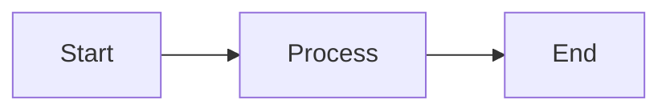

# MobTranslate Documentation

This is the documentation site for MobTranslate, built with [Nextra](https://nextra.site/).

## Development

To run the documentation site locally:

```bash
# From the root directory
pnpm dev --filter=docs

# Or from this directory
pnpm dev
```

The documentation will be available at [http://localhost:3002](http://localhost:3002).

## Structure

```
pages/
├── index.mdx              # Homepage
├── getting-started.mdx    # Getting started guide
├── architecture.mdx       # System architecture
├── dictionaries.mdx       # Dictionary system docs
├── curation.mdx          # Curation system docs
├── deployment.mdx        # Deployment guide
├── contributing.mdx      # Contributing guide
└── api/                  # API documentation
    ├── index.mdx         # API overview
    ├── dictionaries.mdx  # Dictionary endpoints
    ├── translation.mdx   # Translation endpoints
    └── ...              # Other API docs
```

## Writing Documentation

### MDX Support

You can use React components in your markdown:

```mdx
import { Card } from 'nextra/components'

<Card title="Example">
  This is a card component
</Card>
```

### Code Blocks

Use triple backticks with language identifiers:

````markdown
```typescript
const greeting = "Hello, World!";
```
````

### Mermaid Diagrams

Nextra supports Mermaid diagrams:



## Deployment

The documentation can be deployed separately on Vercel:

```bash
vercel --prod
```

Configure your domain to point to `docs.mobtranslate.com`.